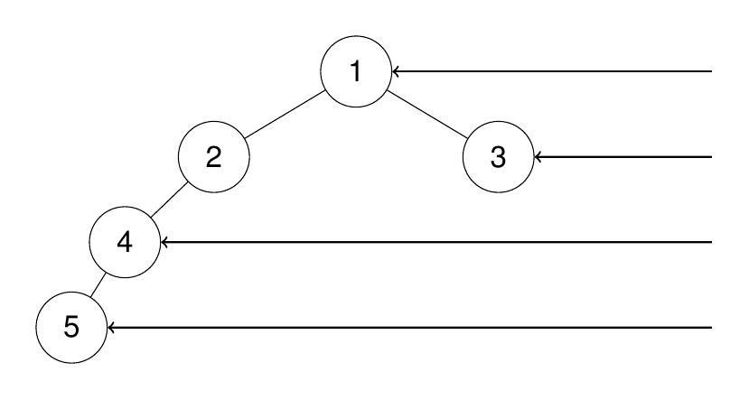

# 199. Binary Tree Right Side View

[LeetCode Problem Page](https://leetcode.com/problems/binary-tree-right-side-view)

Given the `root` of a binary tree, imagine yourself standing on the right side
of it, return the values of the nodes you can see ordered from top to bottom.

# Examples

## Example 1

```text
Input: root = [1,2,3,null,5,null,4]
Output: [1,3,4]
Explanation:
```


## Example 2

```text
Input: root = [1,2,3,4,null,null,null,5]
Output: [1,3,4,5]
Explanation:
```



## Example 3

```text
Input: root = [1,null,3]
Output: [1,3]
```

## Example 4

```text
Input: root = []
Output: []
```

# Constraints

- The number of nodes in the tree is in the range `[0, 100]`.
- `-100 <= Node.val <= 100`.
