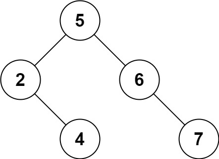

# 450. Delete Node in a BST

[LeetCode Problem Page](https://leetcode.com/problems/delete-node-in-a-bst)

Given a root node reference of a BST (Binary Search Tree) and a key, delete the
node with the given key in the BST. Return the root node reference (possibly
updated) of the BST.

Basically, the deletion can be divided into two stages:

1. Search for a node to remove.
2. If the node is found, delete the node.

**Note:**

> In computer science, a binary search tree (BST), also called an ordered or
> sorted binary tree, is a rooted binary tree data structure with the key of
> each internal node being greater than all the keys in the respective node's
> left subtree and less than the ones in its right subtree.

# Examples

## Example 1


```text
Input: root = [5,3,6,2,4,null,7], key = 3
Output: [5,4,6,2,null,null,7]
Explanation: Given key to delete is 3. So we find the node with value 3 and delete it.
One valid answer is [5,4,6,2,null,null,7], shown in the above BST.
Please notice that another valid answer is [5,2,6,null,4,null,7] and it's also accepted.
```



## Example 2

```text
Input: root = [5,3,6,2,4,null,7], key = 0
Output: [5,3,6,2,4,null,7]
Explanation: The tree does not contain a node with value = 0.
```

## Example 3

```text
Input: root = [], key = 0
Output: []
```

# Constraints

- The number of nodes in the tree is in the range `[0, 10^4]`.
- `-10^5 <= Node.val <= 10^5`.
- Each node has a unique value.
- `root` is a valid binary search tree.
- `-10^5 <= key <= 10^5`

# Follow up

Could you solve it with time complexity `O(height of tree)`?
